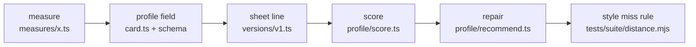

# Contributing to gras_to_text

These rules keep the package small, measurable, and honest about what it can do. They apply to people and to coding bots. Bots also follow `AGENTS.md`.

## Setup

```bash
git clone https://github.com/Magken/gras_to_text.git
cd gras_to_text
npm install
npm run check
npm test
```

Both must pass before you start. If they do not, open an issue instead of working around it.

## The four rules

1. **Every change is proved by a test that fails without it.** Write the test, watch it fail, then write the code.
2. **Every test has a negative case.** A check that only says "yes" proves nothing. Add an input it must reject.
3. **A failing test is information, never an obstacle.** Find out whether the code, the fixture, or the expectation is wrong. Do not loosen a threshold, delete an assertion, or skip a case to get green.
4. **The sheet only asks for what it shows, and the score only scores what the sheet asked for.** If a new measure appears in the score, the sheet must tell the writer about it first.

## Where code goes

| Folder | Put here | Do not put here |
|---|---|---|
| `ts/src/input/` | Reading files, splitting text | Counting |
| `ts/src/measures/` | One count per file, pure functions over sentences or words | Sheet wording |
| `ts/src/hierarchy/` | Rolling counts up a level | New counts |
| `ts/src/profile/` | Sheet lines, score, repair list, copy checks | File reading |
| `ts/src/versions/` | The loop that builds a profile. `v1.ts` stays; a big change becomes `v2.ts` beside it | Helpers used elsewhere |
| `ts/src/types/card.ts` | Types that match `spec/card.schema.json` | Logic |

Tests mirror the source folders. `ts/src/measures/rhythm.ts` is proved by `tests/measures/rhythm.unit.mjs`. A file named `*.unit.mjs` anywhere under `tests/` is picked up by `npm test`.

## Code style

- A comment at the top of each file says what it measures or produces, in one or two sentences.
- Types first, then constants, then functions.
- Pure functions. No hidden state, no network, no reading files outside `input/`.
- No new dependency without a reason in the pull request.
- Comments say what the code cannot show, such as a limit or a source for a number. Not what the next line does.

## Sheet and repair wording

The sheet is read by a model and by people. Write it like instructions to a careful writer.

- Plain words. "About 3 in 10 sentences", not "30% of the sentence population".
- Rates, never the sample's size. No paragraph count, word count, or paragraph positions. The reader may want one paragraph.
- Give a range and say where to stop: "until spoken sentences run 12 to 14 words", not "make them longer".
- Quote a real sentence from the sample as the example, and say it shows the build, not the content.
- Set rates against ordinary English prose only when it helps the writer see the difference.

## Adding a measure

Follow the order below. Each step lands with its test before the next step starts.



1. **Measure.** Add `ts/src/measures/x.ts` and `tests/measures/x.unit.mjs`. Check it on the suite texts (`tests/suite/texts/essay.txt`, `austen.txt`) and on the blind stories before you trust it. Count false hits by reading them.
2. **Profile field.** Add it to `ts/src/types/card.ts` and `spec/card.schema.json`. Make it optional if a text can lack it. Run `npx tsx ../tests/card.schema.unit.mjs`.
3. **Sheet line.** Write the line in `v1.ts` only when the sample shows the feature. Test the wording in `tests/versions/guideLines.unit.mjs`, with a negative for a sample that lacks it.
4. **Score.** Push a miss in `score.ts` only for what the sheet showed. Test in `tests/profile/score.unit.mjs`.
5. **Repair.** Add the repair in `recommend.ts` with a threshold, a range, and a stopping point. Test the exact text and a case that must not trigger it.
6. **Style miss rule.** Add the same threshold to `tests/suite/distance.mjs` so the long tests count it the way the repair list does.
7. **Stored output.** Run `essay-bot.unit.mjs`, read the diff, accept it if it is what you meant.

## Stored output

`tests/suite/expected/essay-bot.txt` is the full sheet and repair list for the essay. Accept a new version only after you have read the diff and can say why every changed line changed. Say it in the pull request.

## Blind tests

The blind tests are the evidence that the sheet works. They are slow and expensive to redo, so they follow strict rules.

- **Writers never see the sample.** Each writer gets the subject, a length ("about 900 words"), and the sheet pasted in full. No files, no tools, no repository access. Brief only writers get the subject alone.
- **The prompt stays the same across rounds.** Copy it from the previous round:

  ```text
  You are a writer taking part in a blind test. Do NOT open, read, search, or edit any files,
  and do not run any commands. Use no tools at all. Reply with the text only.

  Task: write a new piece of literary prose about <subject>. About 900 words, paragraphs
  separated by blank lines. No title, no headings, no commentary before or after.

  Follow this writing sheet exactly. It was made from another writer's text. Take only the
  shape from it, not the subject:

  ---
  <sheet>
  ---
  ```

- **Pass marks are written before scoring.** They live in the test file header and in its assertions. Changing them after seeing results is not allowed.
- **Old rounds are kept.** Before a new round, move the stories and the exact sheet the writers saw into `tests/suite/texts/blind/roundN/`. Note in the test header why the round failed and what changed.
- **One round per batch of fixes.** Fix everything you know about first, then run one round. Do not run a round to find out what is wrong; read the last report instead.
- **Report numbers that are not gates as numbers.** Austen steering is printed in `_tmp-suite-results/blind-batch.txt`. It is not a pass or fail. Essay steering still must win in 3 of 4 subjects.

## Probes

A throwaway script for looking at data is named `.probe-<thing>.mjs`, sits beside the code it looks at, and is deleted before the pull request. If you write the same probe twice, turn it into a `*.unit.mjs` with a negative case.

## Changelog

`CHANGELOG.md` is the dated history of this package. Keep it current.

1. When behaviour, commands, install, license, or public calls change, add a row the same day, at the top of the table.
2. The date is `YYYY-MM-DD`. The text says what a user of the package would notice.
3. Do not edit or delete older rows. A reversal is a new row.
4. Do not skip the row because the GRAS indexer changelog was updated. This file is the package's own record.
5. `tests/changelog.unit.mjs` checks that these rules are still written here and in `CHANGELOG.md`.

## Releases

A GitHub Release is one git tag (`v0.1.0`) on one commit. That commit is the whole repository at that version. Do not tag individual files. Do not tag every commit. Tag when you cut a version people can install (Git now, npm later). The number in `ts/package.json` must match the tag.

## Pull request checklist

- [ ] `npm run check` passes.
- [ ] `npm test` passes.
- [ ] Each new function has a unit with a negative case.
- [ ] Sheet or repair wording changed: `guideLines.unit.mjs` or `recommend.unit.mjs` covers it, and the stored output diff is explained.
- [ ] Profile shape changed: `card.ts` and `card.schema.json` agree.
- [ ] `spec/tools.json` still lists only `profile`, `render`, and `score`.
- [ ] No probe files, no `_tmp-suite-results/`, no `node_modules/`.
- [ ] `README.md` updated if a command, a folder, or the public calls changed.
- [ ] `CHANGELOG.md` has a dated row for the change.
