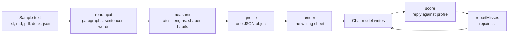
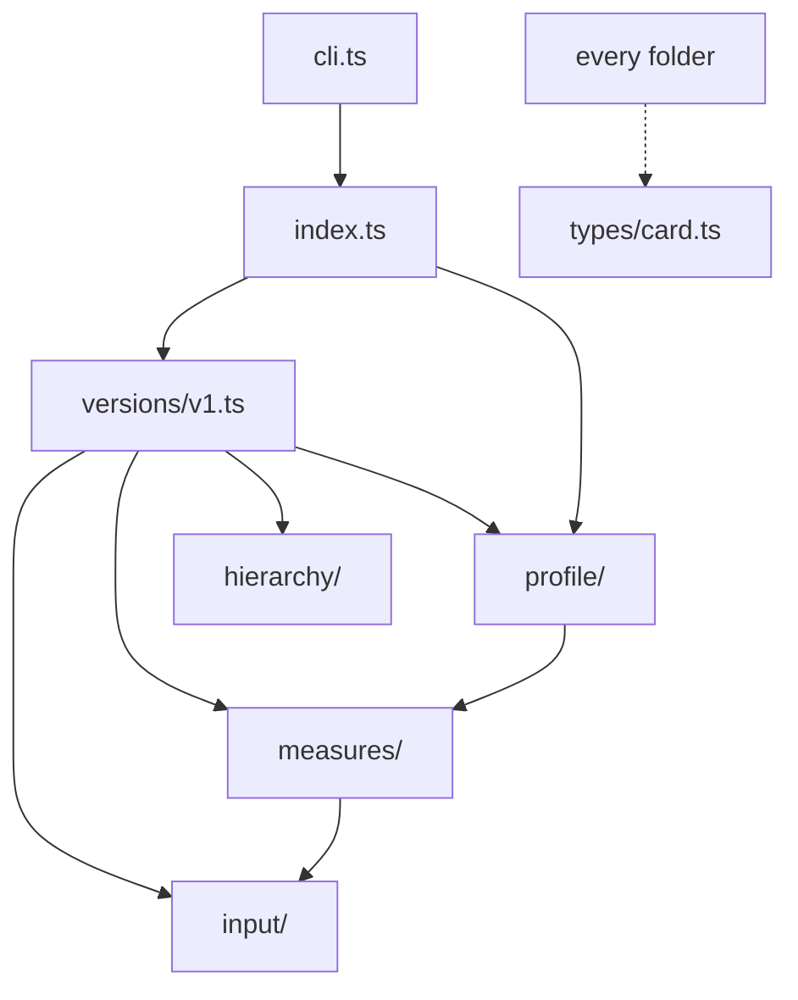

# gras_to_text

Measure how a text is written, then turn those measurements into a writing sheet a chat model can follow.

You give it a sample of writing: an essay, a chapter, a letter, a whole book. It reads the sample and records how the writer builds sentences and paragraphs, which small words they lean on, how long they let sentences run, how their people speak, and a few habits that make the voice recognisable. It then writes that down as plain instructions, largest unit first, with real sentences from the sample as examples.

A model given that sheet can write something new in the same style. When the model replies, gras_to_text can score the reply against the sample and write a short repair list: what drifted, by how much, and what to change.

## What it is for

- Writing new text in the style of a reference text, on any subject.
- Rewriting a text while keeping its voice.
- Checking whether a reply really sounds like the reference, with numbers instead of a feeling.

## What it does not do

- It does not copy the sample's length. A one paragraph request against a whole book as reference gets one paragraph. The sheet gives rates (sentences per paragraph, words per sentence, words per 100), never the sample's paragraph count or word count.
- It does not copy content. The sheet tells the model to take the build of a sentence, not its words, and the score flags any run of four or more words lifted from the examples.
- It does not judge quality. It measures closeness to one reference.

## How it works



1. **Read.** `readInput` accepts plain text, Markdown, PDF, Word, or a JSON document that is already cut into chapters and paragraphs. It splits paragraphs, sentences, and words.
2. **Measure.** Each measure is a small function in `ts/src/measures/`. Examples: sentence length quartiles, glue word rates (the, of, and), commas per sentence and where they fall, the share of pronouns, how long spoken sentences run, and how sentences open.
3. **Profile.** Version 1 (`ts/src/versions/v1.ts`) runs the measures and collects the results into one profile. Its shape is fixed by `spec/card.schema.json`.
4. **Render.** `render` turns the profile into the sheet: a paragraph section, a sentence section, and a word section, each with rates set against ordinary English prose and an example from the sample.
5. **Score.** `score` profiles the reply and lists every gap against the sample profile.
6. **Repair.** `reportMisses` turns the gaps into at most eight fixes, largest first, and names what already matches.

## Install

```bash
npm install @graslabs/gras_to_text
```

Node 20 or later. The license is MIT (`LICENSE`).

### From Git

Clone, then install from the repository root. That installs the TypeScript package under `ts/`.

```bash
git clone https://github.com/Magken/gras_to_text.git
cd gras_to_text
npm install
```

All commands below start in this folder. They forward into `ts/`. The first run with `--tag` downloads an English tagger into `ts/.cache/`. Later tagged runs reuse it.

If you are still inside the GRAS monorepo, `cd projects/gras_to_text` and run the same commands.

### Agent skill (Cursor and Claude)

This is a local skill, not a Cursor marketplace plugin. Clone the repo and Cursor loads `.cursor/skills/gras-to-text/`. Claude Code loads `.claude/skills/gras-to-text/`.

After `npm install @graslabs/gras_to_text`, the skill also sits in `node_modules/@graslabs/gras_to_text/skills/gras-to-text/`. Cursor does not index `node_modules`. If you ask the agent to install the skill, it copies that folder to `.cursor/skills/gras-to-text/` in the current project.

MCP is separate: copy `spec/mcp.example.json` into `.cursor/mcp.json` (start command `npx -y @graslabs/gras_to_text`).

## Using it

Two ways: import the functions in your own code, or run the commands. They do the same work.

### In code

```ts
import { readFileSync, writeFileSync } from 'node:fs'
import { addToDictionary, buildDictionary, dictionaryFromJson, dictionaryToJson, profile, render, reportMisses, score } from '@graslabs/gras_to_text'

const sample = await profile({ path: 'essay.txt' }, { tag: true })
const sheet = render(sample)

const reply = await model.write(sheet, 'Write one paragraph about a lighthouse keeper.')
const misses = await score(reply, sample, { tag: true })
const repairs = reportMisses(misses)

const voice = await buildDictionary({ path: 'essay.txt' }, { tag: true })
const wider = await addToDictionary(voice, { path: 'letter.txt' }, { tag: true })
writeFileSync('voice.json', dictionaryToJson(wider))
const again = await profile({ path: 'new.txt' }, { tag: true, dictionary: dictionaryFromJson(readFileSync('voice.json', 'utf8')) })
```

`{ path }` reads txt, md, json, pdf, or docx. A string is treated as the text itself.

### From the command line

```bash
npm run profile -- "The lamp stood in the window."
npm run profile -- --file ../tests/suite/texts/essay.txt --out essay.md
npm run score -- --sample ../tests/suite/texts/essay.txt --reply mine.txt --out repair.md
npm run dictionary -- --add ../tests/suite/texts/essay.txt --out voice.json
```

With no `--out`, the result prints in the terminal. With `--out name.md`, it writes `output/name.md` (created if missing). With `--out` and a path that includes a folder, that file is used, new or existing.

| Command | What it writes |
|---|---|
| `profile` | A writing sheet from one sample |
| `score` | A repair list: a reply measured against a sample |
| `dictionary` | A JSON word and shape store you can reuse |

| Flag | Meaning |
|---|---|
| `--file PATH` | Sample for `profile` (txt, md, json, pdf, docx) |
| `--sample PATH` | Sample for `score` |
| `--reply PATH` | Text to compare |
| `--out NAME` | File to write. A bare name goes in `output/`. `.md`, `.txt`, or `.json` |
| `--json` `--md` `--txt` | Format. The `--out` extension also sets this |
| `--tag` | Run the part of speech tagger (needed for sentence shapes and pronouns) |
| `--dictionary PATH` | Use a saved dictionary while profiling |
| `--add PATH` | Text to put in a dictionary (repeatable) |
| `--in PATH` | Existing dictionary JSON to add onto |
| `--mode generate` or `--mode regenerate` | New text vs a rewrite of the sample |

`output/` is gitignored except for `.gitkeep`.

A few lines of a real sheet, made from `tests/suite/texts/essay.txt`:

```text
Paragraph. Write as long as you are asked to; take rates from here, not the source's length.
A paragraph holds about 6.6 sentences. ...

Sentence. Mix the lengths: about a quarter of sentences are 6 words or fewer, half fall
between 6 and 19, and a quarter run 19 or more. ... Commas: about 0.5 per sentence, in about
3 in 10 sentences; most come before and, but, or a clause hung on because or who. ...
Now and then a statement is followed by a second reading of it, about once in 100 sentences:
"The not speaking was a kindness, or it was fatigue, and she decided she did not need to know which."
```

And a repair line from a reply that drifted:

```text
3. Speech. A typical spoken sentence in the source is about 13 words; in the reply, about 9.
   Let people say more in each sentence, until spoken sentences run 12 to 14 words.
```

## MCP in Cursor

The server is a local process. Cursor does not clone GitHub to get the tools. Copy `spec/mcp.example.json` into the other project's `.cursor/mcp.json` (or merge the `gras_to_text` block). Restart MCP in that project. The agent then has `profile`, `render`, and `score`.

Copy `spec/mcp.example.json` into the other project's `.cursor/mcp.json` (or merge the `gras_to_text` block). Restart MCP in that project. The agent then has `profile`, `render`, and `score`. The start command is `npx -y @graslabs/gras_to_text`. A local clone can still run `tsx ts/mcp.mjs`.

## Modes

| Mode | Use it when | What changes |
|---|---|---|
| `generate` (default) | The model writes something new | Subject words and names are not asked for. The sample's layout is not a target. Copied phrases and an echoed opening are flagged first. |
| `regenerate` | The model rewrites the sample itself | Subject words and names must stay. Paragraph count and paragraph by paragraph length are checked. |

Pass the mode to both calls: `render(sample, 'prose', { mode: 'regenerate' })` and `reportMisses(misses, { mode: 'regenerate' })`.

## The profile

| Section | What it holds |
|---|---|
| `lexical` | Glue word rates, word variety (MTLD), sentence length quartiles, spoken sentence length, long and marked words |
| `syntactic` | Part of speech rates, sentence openings, sentence shapes with examples, clause joins, punctuation, habits (clause chaining, second reading, short general truths) |
| `semantic` | Empty for now |
| `functional` | Glue words and the roles they take |
| `structural` | One sketch per paragraph: sentence count, lengths, first and last sentence |
| `content` | Subject words and names |
| `language` | Empty for now |
| `guide` | The sheet, largest unit first |

`tag: true` runs an English part of speech tagger (BERT) once per sentence. The first tagged run downloads the model and later runs use the cache in `ts/.cache/`. Without tags the counts that need no tagger still work.

## File structure

```text
gras_to_text/
├── LICENSE                   MIT
├── package.json              install, test, and commands at this folder
├── CHANGELOG.md              what changed, and on which day
├── README.md                 this file
├── CONTRIBUTING.md           rules for people who change the code
├── AGENTS.md                 rules for coding bots that change the code
├── skills/gras-to-text/      local Agent Skill (SKILL.md)
├── .cursor/skills/           same skill for a Cursor clone
├── .claude/skills/           same skill for a Claude Code clone
├── spec/
│   ├── card.schema.json      the profile shape; every package must emit this
│   ├── tools.json            MCP tools: profile, render, score
│   ├── mcp.example.json      how an editor starts the MCP server
│   └── fixtures/             small inputs: txt, md, pdf, docx, tagged json
├── output/                   command results (gitignored; keep .gitkeep)
├── ts/                       the TypeScript package
│   ├── package.json          npm scripts: profile, score, dictionary, test, check, suite, mcp
│   ├── cli.mjs               command entry (npm run profile | score | dictionary)
│   ├── mcp.mjs               MCP process Cursor starts (stdio)
│   ├── server.json           MCP registry entry
│   └── src/
│       ├── index.ts          public calls: profile, render, score, reportMisses
│       ├── cli.ts            parse flags, write output files
│       ├── mcp.ts            MCP server over the same calls
│       ├── input/            read files, split paragraphs, sentences, words
│       ├── measures/         one file per count (rhythm, joins, figures, delta, ...)
│       ├── hierarchy/        roll sentence counts up to paragraphs and sections
│       ├── profile/          sheet lines, score, repair list, copy checks, shapes
│       ├── versions/         v1.ts builds the profile; later versions sit beside it
│       └── types/
│           └── card.ts       TypeScript types matching card.schema.json
├── tests/
│   ├── README.md             where each kind of test goes
│   ├── run.mjs               runs every *.unit.mjs (npm test)
│   ├── input/                one unit per source file, same folder names as ts/src
│   ├── measures/
│   ├── hierarchy/
│   ├── profile/
│   ├── versions/
│   └── suite/                long texts, expected output, and the blind tests
│       ├── cases/            one JSON file per long case
│       ├── texts/            the sample texts and the blind writers' stories
│       └── expected/         stored output compared line by line
└── research/
    ├── sources.md            reading list for the measures
    ├── notes.md              why each measure was chosen
    └── papers/               local copies for study (gitignored; cited in sources.md)
```

How the code depends on itself. Arrows point from the caller to what it uses.



## Tests

Tests are separate from the commands above. They also run from this folder.

```bash
npm install
npm run check      # TypeScript, no output files
npm test           # every *.unit.mjs, a few minutes
npm run suite      # only the long suite
```

A single unit runs from `ts/`, which is the fast way to work:

```bash
cd ts
npx tsx ../tests/measures/figures.unit.mjs
# figures: ok
```

### Kinds of test

| Kind | Where | What it proves |
|---|---|---|
| Unit | `tests/input/`, `tests/measures/`, `tests/profile/`, `tests/versions/` | One function does what it says, including a negative case that must not match |
| Long suite | `tests/suite/suite.unit.mjs` with `cases/*.json` | Whole texts in every input format profile without errors and meet their expectations |
| Stored output | `tests/suite/essay-bot.unit.mjs` | The full sheet and repair list for the essay match `expected/essay-bot.txt` line by line |
| Held out | `tests/suite/heldout.unit.mjs` | The second half of a text scores closer to its own first half than another author does |
| Blind | `tests/suite/blind.unit.mjs`, `blind-batch.unit.mjs` | Stories written by writers who never saw the sample sit closer to it when written from the sheet than from a one line brief |

### What to run for a change

| You changed | Run |
|---|---|
| One function | Its unit, for example `npx tsx ../tests/profile/score.unit.mjs` |
| Anything the sheet says | `npx tsx ../tests/versions/guideLines.unit.mjs`, then `npx tsx ../tests/suite/essay-bot.unit.mjs` |
| The profile shape | `npx tsx ../tests/card.schema.unit.mjs` and `npm run check` |
| Score or repair wording | `npx tsx ../tests/profile/recommend.unit.mjs` and `npx tsx ../tests/profile/score.unit.mjs` |
| CLI flags, `output/` paths | `npx tsx ../tests/cli.unit.mjs` |
| MCP tools, stdio process | `npx tsx ../tests/mcp.unit.mjs` |
| License, clone install, papers gitignore | `npx tsx ../tests/package.unit.mjs` |
| Before a pull request | `npm run check` and `npm test` |

When `essay-bot.unit.mjs` fails it prints a line diff. If the change was meant, read the diff, then accept it:

```bash
GRAS_UPDATE_GOLDEN=1 npx tsx ../tests/suite/essay-bot.unit.mjs     # macOS, Linux
$env:GRAS_UPDATE_GOLDEN='1'; npx tsx ../tests/suite/essay-bot.unit.mjs; Remove-Item Env:GRAS_UPDATE_GOLDEN   # PowerShell
```

The blind tests write a report to `_tmp-suite-results/` (not committed), for example:

```text
=== Against essay ===
same-author floor (first half vs second half): Delta 7.55
clock   style 6 vs 11 | Delta sheet 10.19, brief 12.26 | copied 0, traced 0
mean style 5.50 vs 9.25; mean Delta 10.64 vs 12.96; the sheet closes 43% of the gap
```

Style means how many measured targets the story missed. Delta is Burrows Delta over glue word rates; lower is closer.

## Status

- English only. `semantic` and `language` are empty. Character n-grams (`measures/ngrams.ts`) are not built.
- The essay passes every blind test, including steering. The Austen sample passes on style and Delta. Austen steering is counted in the report (currently 2 of 4) and is not a pass or fail, because writers still keep ordinary rates for "the" and "of".
- MIT license. Public on npm as `@graslabs/gras_to_text`. Clone it with Git (see Install). The MCP server runs locally (`npx -y @graslabs/gras_to_text` or `npm run mcp`). It is not on the MCP Registry yet.

## Contributing

Read `CONTRIBUTING.md` before you open a pull request. Coding bots read `AGENTS.md`.
